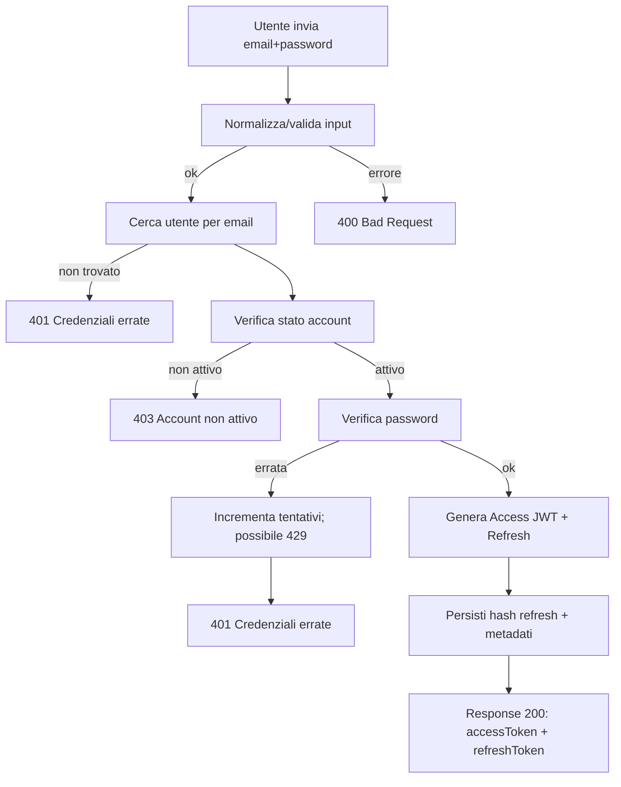
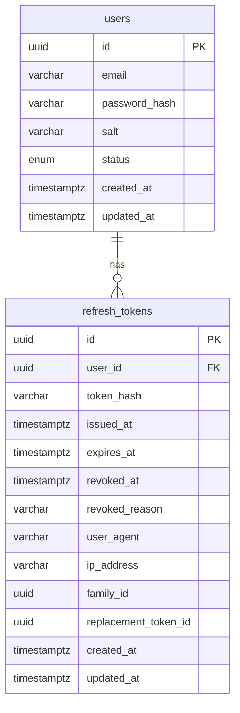

# SmartDesk Coworking - Flusso di Autenticazione JWT (Design)

Obiettivo: definire flusso di login basato su email e password con emissione di Access Token (JWT) e Refresh Token, gestione sicura delle secret key e tracciamento delle sessioni/refresh per revoca e logout.

Contesto attuale (stato modello utente)
- Tabella users (schema sincronizzato con Prisma):
  - id (UUID), email (unique), password_hash, salt (opzionale), status (enum: ACTIVE, PENDING_VERIFICATION, SUSPENDED, DISABLED)
  - created_at, updated_at; campi opzionali verification_token e verification_expires_at
- Ruoli/profili: non presenti attualmente. Per la PWA si assume ruolo implicito USER; futura estensione: tabella user_roles o colonna roles JSONB.

Token e algoritmi
- Access Token: JWT firmato HS256
  - Scopo: autenticazione veloce lato API Gateway/PWA
  - TTL raccomandato: 15 minuti (configurabile)
- Refresh Token: stringa opaca lunga (64-128 bytes base64url) conservata lato client; a DB memorizzata solo la versione hash (no plaintext)
  - Scopo: ottenere nuovi Access Token senza chiedere credenziali
  - TTL raccomandato: 30 giorni (configurabile)
- Algoritmo firma: HS256 (HMAC-SHA256) con secret distinta per access e refresh
- Gestione secret key: tramite variabili d’ambiente o secret manager
  - JWT_ACCESS_SECRET (min 32 byte), JWT_REFRESH_SECRET (min 32 byte)
  - JWT_ISSUER, JWT_AUDIENCE
  - JWT_ACCESS_TTL (es: 15m), JWT_REFRESH_TTL (es: 30d)

Payload minimo JWT (Access Token)
- Registered claims:
  - iss (issuer), aud (audience), iat, exp
  - sub: userId
- Custom claims:
  - email: email normalizzata
  - roles: array di stringhe (es. ["USER"]) — opzionale fino all’introduzione dei ruoli
  - ver: versione schema claims (per evoluzione futura), es. 1
  - tenant: opzionale se multi-tenant in futuro

Regole di validazione login
1) Normalizza email (trim, lowercase) e valida formato
2) Verifica password secondo password policy esistente (InputValidator)
3) Recupera utente per email
4) Verifica stato account:
   - DISABLED/SUSPENDED: rifiuta (403)
   - PENDING_VERIFICATION: rifiuta (403) con messaggio "account non verificato"
5) Verifica password usando PasswordService.verifyPassword
6) Se ok, emetti Access Token e genera Refresh Token (rotazione) persistendo la sola hash del refresh in DB

Casi di errore e mapping HTTP
- 400: input non valido (email/password mancanti o formato errato)
- 401: credenziali errate (email non trovata o password errata)
- 403: account non attivo (DISABLED/SUSPENDED/PENDING_VERIFICATION)
- 429: troppe richieste/troppi tentativi (rate limiting o lockout temporaneo)
- 500: errore interno

Rate limiting e blocco tentativi
- Protezioni consigliate:
  - Rate limit per IP (es. 10 req/min) lato edge/gateway
  - Brute-force protection per coppia email+IP: finestra mobile e lockout temporaneo (es. 5 tentativi falliti => lock per 15 minuti)
- Persistenza suggerita: store in-memory/Redis per contatori; opzionale tracciamento in DB per audit

Sessioni e refresh tokens
- Strategia: sessione utente rappresentata dai refresh tokens attivi
- Tabella refresh_tokens (design in fondo) con:
  - user_id, token_hash, issued_at, expires_at, revoked_at, revoked_reason
  - user_agent, ip_address (osservabilità), family_id (rotazione), replacement_token_id (catena rotazioni)
- Regole di rotazione:
  - Ad ogni uso del refresh per ottenere nuovi token: marcatura revoked_at del token usato, emissione nuovo refresh (replacement) con stesso family_id
  - Se arriva un token già revocato => sospetto furto: revocare l’intera famiglia (revoke-by-family)
- Logout:
  - Revoca puntuale del refresh corrente (revoked_at/reason = LOGOUT)
- Logout globale (tutti dispositivi): revoca per user_id su tutti i refresh attivi

Sicurezza
- Conservare solo hash dei refresh token:
  - Calcolo hash consigliato: HMAC-SHA256(refreshToken, JWT_REFRESH_SECRET) oppure scrypt del token con salt random e pepper app-specifica
  - Non loggare mai token o hash
- Impostare cookie httpOnly/secure/sameSite=strict per refresh token se inviato via cookie; in alternativa usarlo nello storage sicuro dell’app PWA (consapevoli dei trade-off)

Configurazioni (env)
- JWT_ACCESS_SECRET, JWT_REFRESH_SECRET
- JWT_ISSUER=smartdesk
- JWT_AUDIENCE=smartdesk-pwa
- JWT_ACCESS_TTL=15m
- JWT_REFRESH_TTL=30d
- REFRESH_TOKEN_BYTES=64 (byte prima di base64url)

High-level Flow (Mermaid)

Data Model (Mermaid ER)

Response Login (esempio)
- 200 OK
  - data: { accessToken, expiresIn, refreshToken (opzionale a seconda del canale di consegna), tokenType: "Bearer" }

Pseudocodice generazione token
- access = signHS256({ sub, email, roles, iat, exp, iss, aud, ver }) con JWT_ACCESS_SECRET
- refreshPlain = base64url(randomBytes(REFRESH_TOKEN_BYTES))
- refreshHash = HMAC-SHA256(refreshPlain, JWT_REFRESH_SECRET)
- Persist refreshHash, expiresAt = now + TTL
- Rispondere con access e refreshPlain

Note future
- Introdurre ruoli (user_roles) e permessi granulari
- Supporto token invalidation per access token via jti+denylist quando necessario
- WebAuthn/2FA per hardening accessi
