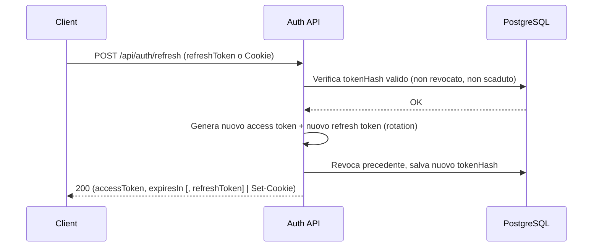

# Autenticazione JWT e Flusso di Refresh

Versione: 1.0  
Data: 17/01/2026  
Autore: Security/Backend Team  
Stato: Draft

---

## 1. Panoramica

Il backend espone un meccanismo di autenticazione stateless basato su JSON Web Token (JWT) composto da:
- Access token: breve durata, usato per autenticare ogni richiesta alle API protette via header Authorization: Bearer.
- Refresh token: durata più lunga, usato per ottenere un nuovo access token quando è scaduto.

Tecnologie e algoritmi previsti:
- Firma JWT: HS256 (secret condiviso) o RS256 (chiave privata/pubblica) definiti a livello di ambiente.
- Persistenza refresh token: tabella dedicated nel DB (hash del token, scadenza, revoca, device/ip/user-agent).

Durate consigliate (configurabili via env):
- ACCESS_TOKEN_TTL: 15m (10–30m suggerito)
- REFRESH_TOKEN_TTL: 7d (7–30d suggerito)

Formato token e claim principali:
- Access token (JWT):
  - sub: id utente (UUID)
  - email: email utente
  - iat, exp: issued at / expiration
  - jti: id token opzionale (utile per tracciamenti)
  - scope/permessi: opzionale (non obbligatorio, dipende dal modello ruoli)
- Refresh token: stringa opaca non JWT, generata in modo sicuro (casuale), memorizzata in DB come hash (tokenHash) con scadenza e metadati; non contiene claim leggibili lato client.

Note modello dati: esiste la tabella refresh_tokens con i campi chiave: user_id, token_hash, expires_at, is_revoked, replaced_by_token_hash, ip_address, user_agent.

---

## 2. Middleware JWT e protezione delle rotte

- Rotte tipicamente pubbliche (nessun JWT richiesto):
  - POST /api/auth/login
  - POST /api/auth/refresh
  - eventuali /api/public/**
- Rotte protette (JWT richiesto nell'Authorization header):
  - Tutte le altre /api/** (es. /api/users/me, /api/projects, ...)

Comportamento middleware:
- Assenza header Authorization: 401 Unauthorized (code: AUTH_MISSING_TOKEN)
- Formato header non valido (es. no "Bearer "): 401 Unauthorized (code: AUTH_INVALID_FORMAT)
- Token scaduto o firma non valida: 401 Unauthorized (code: AUTH_TOKEN_INVALID_OR_EXPIRED)
- Utente bloccato (account_status = BLOCKED): 403 Forbidden (code: AUTH_ACCOUNT_BLOCKED)
- In caso di validazione positiva: il contesto richiesta viene popolato con l'identità dell'utente (userId, email, eventuali scope) e passa alla rotta.

Best practice aggiuntive:
- Rate limiting su login/refresh.
- Logging strutturato senza mai includere passwordHash, salt, verificationToken o token in chiaro.

---

## 3. Endpoint di refresh

- Metodo: POST
- URL: /api/auth/refresh

Modalità supportate:
1) Body JSON
- Request body:
  {
    "refreshToken": "<refresh_token>"
  }
- Headers: Content-Type: application/json

2) Cookie (opzionale, se abilitato)
- Cookie HttpOnly, Secure, SameSite=strict|lax (es. nome: refresh_token)
- Nessun campo nel body richiesto in questo caso.

Validazione e logica:
- Il backend calcola l'hash del refresh_token presentato e cerca una riga valida in refresh_tokens per lo user associato.
- Controlli:
  - esistenza, non revocato (is_revoked=false), non scaduto (expires_at > now)
  - optional: controllo ip/user-agent per mitigare furto token
- Rotation: alla chiamata di refresh, il token usato viene ruotato:
  - si marca quello precedente come revocato e replaced_by_token_hash
  - si emette un nuovo refresh token e si salva (hash) con nuova scadenza
  - si emette un nuovo access token
- Se la rotation è abilitata ma il token risulta già usato/revocato: possibile 409 Conflict (REPLAY_DETECTED) e invalidazione sessione.

Risposta OK (200):
{
  "accessToken": "<jwt>",
  "expiresIn": 900,        // secondi (es. 15m)
  "tokenType": "Bearer",
  "refreshToken": "<refresh_token_nuovo>"  // opzionale, se rotation via body
}
- In modalità cookie, il nuovo refresh token viene impostato nel Set-Cookie e non torna nel body.

Codici errore:
- 400 Bad Request (code: REFRESH_BAD_REQUEST) – payload assente o malformato
- 401 Unauthorized (code: REFRESH_INVALID_TOKEN) – token inesistente/non valido/scaduto
- 403 Forbidden (code: AUTH_ACCOUNT_BLOCKED) – account bloccato
- 409 Conflict (code: REFRESH_REPLAY_DETECTED) – token già usato/ruotato
- 429 Too Many Requests (code: RATE_LIMITED) – rate limit superato
- 500 Internal Server Error – errore inatteso

---

## 4. Esempi di richieste/risposte

4.1 Autenticazione iniziale (login)
- POST /api/auth/login
- Body: { "email": "user@example.com", "password": "<password>" }
- Response 200:
{
  "accessToken": "<jwt>",
  "expiresIn": 900,
  "tokenType": "Bearer",
  "refreshToken": "<refresh_token>"
}
- Variante cookie: Set-Cookie: refresh_token=<value>; HttpOnly; Secure; SameSite=Lax; Path=/api/auth; Max-Age=604800

4.2 Chiamata a endpoint protetto
- GET /api/users/me
- Headers:
  Authorization: Bearer <access_token>
- Response 200:
{
  "id": "<uuid>",
  "email": "user@example.com"
}
- Errori possibili: 401 (token scaduto/invalid), 403 (account bloccato)

4.3 Refresh con body JSON
- POST /api/auth/refresh
- Body:
{
  "refreshToken": "<refresh_token>"
}
- Response 200:
{
  "accessToken": "<jwt_nuovo>",
  "expiresIn": 900,
  "tokenType": "Bearer",
  "refreshToken": "<refresh_token_nuovo>"
}

4.4 Refresh con cookie
- POST /api/auth/refresh
- Headers: Cookie: refresh_token=<value>
- Response 200: come sopra ma senza refreshToken nel body; il nuovo cookie è nel Set-Cookie.

4.5 Errori tipici
- 401 Unauthorized:
{
  "error": {
    "code": "AUTH_TOKEN_INVALID_OR_EXPIRED",
    "message": "Access token non valido o scaduto"
  }
}
- 409 Conflict (replay):
{
  "error": {
    "code": "REFRESH_REPLAY_DETECTED",
    "message": "Refresh token già utilizzato"
  }
}

---

## 5. Note di sicurezza

- Conservazione sicura token lato client:
  - Access token: solo in memoria (runtime). Evitare localStorage se possibile; se usato, valutare i rischi XSS.
  - Refresh token: preferibile in HttpOnly Secure Cookie. In alternativa, se in storage applicativo, cifrare e minimizzare l'esposizione.
- HTTPS obbligatorio in produzione (cookie Secure, HSTS).
- Rotation obbligatoria dei refresh token; revoca immediata del precedente.
- Protezione da furto token:
  - Associare refresh token a ip/user-agent e invalidare se mismatch sospetto.
  - In caso di furto sospetto, revocare tutti i refresh token dell'utente e forzare logout su tutti i device.
- Rate limiting e protezione bruteforce su /api/auth/login e /api/auth/refresh.
- CSRF:
  - Se si usano cookie per i refresh, impostare SameSite=Lax/Strict e valutare anti-CSRF token per chiamate state-changing.
- Logging: mai loggare token in chiaro, passwordHash, salt, verificationToken o i loro hash; loggare solo identificatori non sensibili (jti troncato, userId) e codici esito.

---

## 6. Variabili di ambiente

- JWT_ALG: HS256 | RS256
- JWT_SECRET: secret per HS256 (non commitare mai)
- JWT_PRIVATE_KEY / JWT_PUBLIC_KEY: chiavi per RS256 (PEM)
- ACCESS_TOKEN_TTL: es. 15m
- REFRESH_TOKEN_TTL: es. 7d
- REFRESH_COOKIE_NAME: es. refresh_token
- REFRESH_COOKIE_DOMAIN / PATH / SECURE / SAMESITE
- RATE_LIMIT_LOGIN / RATE_LIMIT_REFRESH

---

## 7. Sequenza di refresh (diagramma)

---

## 8. Compatibilità e integrazione frontend

- Il frontend deve intercettare 401 su endpoint protetti e tentare un refresh automatico (una sola volta) prima di rilanciare la richiesta originale.
- In caso di fallimento del refresh, eseguire logout locale e reindirizzare alla pagina di login.
- Evitare richieste concorrenti di refresh: utilizzare un meccanismo di queue/lock lato client per serializzare il refresh.
