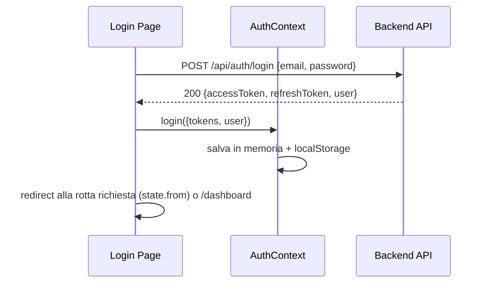
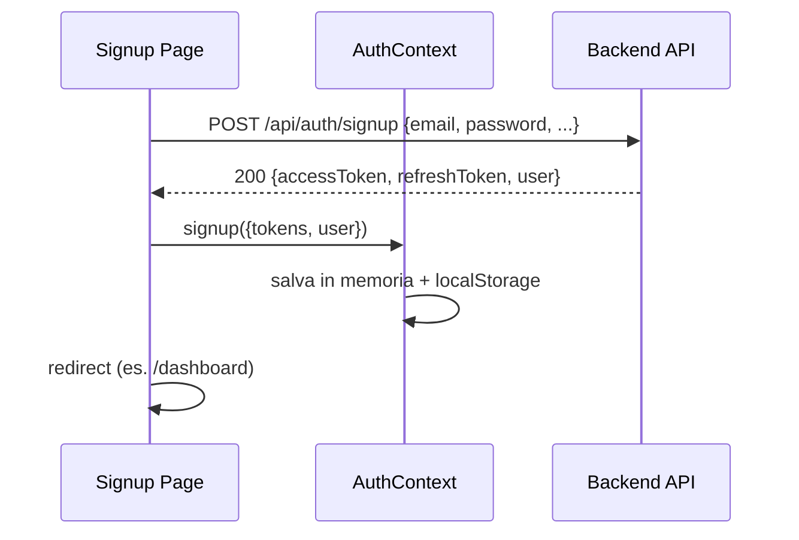
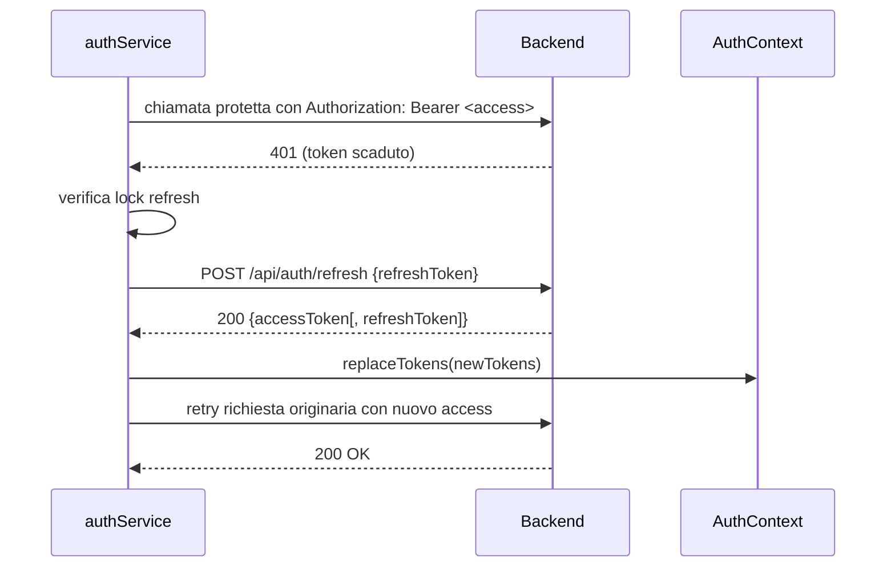

# Gestione Autenticazione JWT nel Frontend (PWA)

Versione: 1.0
Data: 17/01/2026
Autore: Frontend Team
Stato: Draft

Riferimenti:
- Backend: vedi docs/authentication-jwt.md (flusso, sicurezza, refresh, errori)

---

## 1) Architettura lato Frontend

Componenti principali previsti/implementati per l’autenticazione nella SPA React:

- AuthContext (frontend/src/context/AuthContext.tsx)
  - Stato globale di autenticazione: user, tokens, isAuthenticated
  - API esposta: login, signup, logout, setUser, replaceTokens
  - Persistenza attuale: localStorage (chiavi: auth.accessToken, auth.refreshToken, auth.user)
  - Ripristino stato da storage al mount del provider

- ProtectedRoute (frontend/src/router/ProtectedRoute.tsx)
  - Wrapper per rotte protette: se non autenticati, redirect a /login preservando lo state.from per il ritorno post‑login

- AppRouter (frontend/src/router/AppRouter.tsx)
  - Esempi di route pubbliche (/login, /signup) e protette (/dashboard, /timesheet, /projects)
  - Dimostra la navigazione post‑login/signup verso la destinazione attesa

- authService (da implementare)
  - Modulo di chiamata API (fetch/axios) che allega automaticamente l’Authorization: Bearer <access_token>
  - Intercettazione 401 → tentativo di refresh automatico → retry della richiesta → logout se refresh fallisce
  - Serializzazione richieste di refresh per evitare race conditions

- tokenStorage (da implementare)
  - Astrazione per la gestione token (memoria + storage persistente), utile per sostituire facilmente localStorage con alternative (sessionStorage o cookie HttpOnly lato backend)

Nota: al momento nel repo sono presenti AuthContext e ProtectedRoute; authService e tokenStorage sono suggeriti come strato di infrastruttura da aggiungere.

---

## 2) Flussi principali

### 2.1 Login



Passi chiave:
- La pagina login invoca /api/auth/login
- In caso di successo: chiama AuthContext.login con i token e l’utente
- I token vengono salvati sia in memoria che in localStorage; segue redirect

### 2.2 Signup



### 2.3 Accesso a rotte protette

- Il router racchiude le pagine protette con <ProtectedRoute/>
- Se isAuthenticated = false → redirect a /login con state.from = path originale

### 2.4 Refresh automatico dell’access token (da implementare in authService)



In caso di errore al refresh (401/409/403):
- authService notifica il contesto → logout locale → redirect a /login

---

## 3) Salvataggio token e sicurezza

Stato attuale:
- Access token: salvato in memoria e persistito in localStorage
- Refresh token: salvato in memoria e persistito in localStorage

Implicazioni di sicurezza:
- localStorage è vulnerabile a XSS: un attacco XSS può esfiltrare i token
- Alternative raccomandate:
  - Refresh token in cookie HttpOnly + Secure + SameSite (vedi docs/authentication-jwt.md)
  - Access token solo in memoria (non persistito), con flusso di silent refresh
  - In alternativa, sessionStorage (persiste solo nella tab), ma non risolve XSS

Raccomandazioni pratiche:
- Implementare CSP, sanitizzazione input e audit XSS
- Non loggare mai i token né inviarli a terze parti
- Sincronizzare logout tra tab via storage event

---

## 4) Allegare i token alle richieste

Linea guida:
- Usare un modulo centralizzato (authService/api client) per aggiungere l’header Authorization: Bearer <access_token>
- Gestire 401 e refresh in un solo punto

Esempio con fetch (scheletro):

```ts
// src/services/tokenStorage.ts (suggerito)
export const tokenStorage = {
  getAccess: () => localStorage.getItem('auth.accessToken') || '',
  getRefresh: () => localStorage.getItem('auth.refreshToken') || '',
  setTokens: (access: string, refresh: string) => {
    localStorage.setItem('auth.accessToken', access);
    localStorage.setItem('auth.refreshToken', refresh);
  },
  clear: () => {
    localStorage.removeItem('auth.accessToken');
    localStorage.removeItem('auth.refreshToken');
  }
};

// src/services/authService.ts (suggerito)
let refreshPromise: Promise<void> | null = null;

async function refreshTokens() {
  if (!refreshPromise) {
    refreshPromise = (async () => {
      const rt = tokenStorage.getRefresh();
      if (!rt) throw new Error('NO_REFRESH');
      const res = await fetch('/api/auth/refresh', {
        method: 'POST',
        headers: { 'Content-Type': 'application/json' },
        body: JSON.stringify({ refreshToken: rt })
      });
      if (!res.ok) throw new Error('REFRESH_FAILED');
      const payload = await res.json();
      tokenStorage.setTokens(payload.accessToken, payload.refreshToken ?? rt);
    })().finally(() => { refreshPromise = null; });
  }
  return refreshPromise;
}

export async function apiFetch(input: RequestInfo, init: RequestInit = {}) {
  const headers = new Headers(init.headers);
  const access = tokenStorage.getAccess();
  if (access) headers.set('Authorization', `Bearer ${access}`);
  let res = await fetch(input, { ...init, headers });
  if (res.status === 401) {
    try {
      await refreshTokens();
      const retryHeaders = new Headers(init.headers);
      const newAccess = tokenStorage.getAccess();
      if (newAccess) retryHeaders.set('Authorization', `Bearer ${newAccess}`);
      res = await fetch(input, { ...init, headers: retryHeaders });
    } catch (e) {
      // TODO: dispatch logout tramite AuthContext se disponibile
      tokenStorage.clear();
      throw e;
    }
  }
  return res;
}
```

Nota: in un’app reale, collegare authService con AuthContext (replaceTokens / logout) per mantenere lo stato consistente.

---

## 5) Logout e pulizia token

- Invocare AuthContext.logout()
  - Pulisce stato in memoria
  - Rimuove token e user dal localStorage
- Opzionale (raccomandato): chiamare backend revoke/logout per invalidare il refresh token server‑side
- Reindirizzare l’utente alla pagina /login

Snippet:

```ts
const { logout } = useAuth();
<button onClick={logout}>Logout</button>
```

---

## 6) Aggiungere nuove rotte protette

- Avvolgere le rotte che richiedono autenticazione con il wrapper <ProtectedRoute/>
- Esempio (estratto da AppRouter.tsx):

```tsx
<Routes>
  {/* Pubbliche */}
  <Route path="/login" element={<LoginPage />} />
  <Route path="/signup" element={<SignupPage />} />

  {/* Protette */}
  <Route element={<ProtectedRoute />}> 
    <Route path="/dashboard" element={<DashboardPage />} />
    <Route path="/timesheet" element={<TimesheetPage />} />
    <Route path="/projects" element={<ProjectsPage />} />
  </Route>
</Routes>
```

- Per preservare il percorso di origine, ProtectedRoute utilizza state.from durante il redirect a /login

---

## 7) TODO e miglioramenti futuri

- Spostare il refresh token in cookie HttpOnly + Secure + SameSite (server) per mitigare XSS
- Conservare l’access token solo in memoria e ridurre la persistenza su storage
- Implementare silent refresh proattivo quando exp sta per scadere (buffer di 30–60s)
- Gestire auto‑logout su scadenza refresh o inattività (idle timer)
- Sincronizzare login/logout multi‑tab con storage event o BroadcastChannel
- Implementare endpoint /api/auth/logout che revoca i refresh token server‑side
- Gestione errori centralizzata con messaggi UX coerenti (401/403/409 dei flussi refresh)
- Strutturare authService con axios + interceptor per maggiore ergonomia
- Telemetria lato client degli eventi auth (login_success, refresh_failed, logout)

---

## 8) Check di conformità con backend

- Authorization: Bearer <access_token> per tutte le API protette
- Endpoint refresh: POST /api/auth/refresh (body { refreshToken } oppure cookie HttpOnly se abilitato)
- Gestione errori in linea con docs/authentication-jwt.md (401, 403, 409)
- Non loggare mai token in chiaro lato client

---

## 9) Struttura consigliata dei file (frontend)

- src/context/AuthContext.tsx (presente)
- src/router/ProtectedRoute.tsx (presente)
- src/router/AppRouter.tsx (presente, esempio di configurazione)
- src/services/tokenStorage.ts (suggerito)
- src/services/authService.ts (suggerito)
- src/pages/Login.tsx, src/pages/Signup.tsx (da consolidare in componenti reali)

Questa documentazione descrive lo stato attuale e le estensioni previste per un’integrazione completa con il backend JWT/refresh token illustrato in docs/authentication-jwt.md.